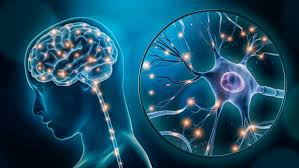

---
hide:
  -navigation
---

# Welcome to my wesbite

## I am a cognitive Neuroscientist with a background in Biomedical Engineering

Bla Bla Bla about myself

{ align=right width="600"}

During the workshop we will set up our own website using [Material for MkDocs] and [GitHub Pages].[^1]

After going through this workshop you'll have a first draft of your website and the skills to develop the website further on your own.

[Get started](https://julia-pfarr.github.io/workshop_webdesign/installing/){ .md-button }

Find additional background information on web design, the utilized tools in this workshop and CI on GitHub in these 

[Google Slides](https://docs.google.com/presentation/d/16Rgdn_-uqjZVwmeyDhGL41vKMRCFA0dSom2IpreZ59I/edit?usp=sharing){ .md-button .md-button--primary }

  
[^1]: This website contains instructions on how to create a personal website using Material for MkDocs and is thus heavily based on the documentation pages for MkDocs, Material for MkDocs, and GitHub Pages. I want to thank the developers for making their software and documentation freely available for everyone.
[^2]: Image by storyset, retrieved from freepik.

[Material for MkDocs]: https://squidfunk.github.io/mkdocs-material/
[GitHub Pages]: https://pages.github.com/